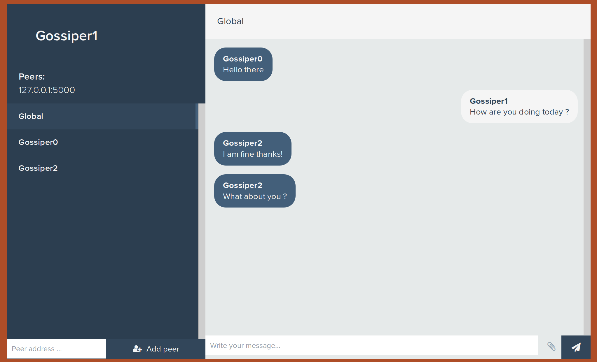

# Peerster

Decentralized Systems Engineering homework

## What is this repo

The Peerster is a decentralised messaging and file sharing application.

## Dependencies

To run this application, you will need to have go installed on your machine. You also need the package [protobuf](https://github.com/DeDiS/protobuf) from the [DEDIS](https://www.epfl.ch/labs/dedis/), it can be downloaded using:

```bash
go get github.com/dedis/protobuf
```

You will need to install the peerster folder at the following location `$GOPATH/src/github.com/guillaumemichel/Peerster`. You can easily do so by using the command:

```bash
go get github.com/guillaumemichel/Peerster
```

## How to run it

Please build the program by using `go build` in `Peerster/` and in `Peerster/client/`. Once it is done, you can start Peerster instances. The usage of `./Peerster` is the following:

```bash
Usage of ./Peerster:
  -GUIPort string
        port for the GUI client (default "8080")
  -UIPort string
        port for the UI client (default "8080")
  -antiEntropy int
        Use the given timeout in seconds for anti-entropy. If the flag is absent, the default anti-entropy duration is 10 seconds. (default 10)
  -gossipAddr string
        ip:port for the gossiper (default "127.0.0.1:5000")
  -name string
        name of the gossiper (default "258066")
  -peers string
        comma separated list of peers of the form ip:port
  -rtimer int
        Timeout in seconds to send route rumors. 0 (default) means disable sending route rumors.
  -simple
        run gossiper in simple broadcast mode
```

You can interract with the gossiper using a client. The usage is the following:

```bash
Usage of ./client:
  -UIPort string
        port for the UI client (default "8080")
  -dest string
        destination for the private message; can be omitted
  -file string
        file to be indexed by the gossiper
  -msg string
        message to be sent
  -request string
        request a chunk or metafile of this hash
```

## How to use the GUI



In order to use the GUI, please connect to `localhost:8080` or whatever -GUI flag you set for the gossiper.

### Adding peers

You can add peers using the `add peer` input and button at the bottom left of the interaface. You should input a valid IP address along with a port (e.g `127.0.0.1:5000`).

### Global messages

The only chat you will have when lauching a gossiper is the global chat. The messages you will send here will be broadcasted to all connected gossipers.

### Private messages

When the gossiper will discover new contacts, these new contacts will appear in the sidebar on the left of the interface. You can select a contact to have a private chat with them.

### Files


Next to the button to send a message, there is a `file` button. When clicking it, it opens the file interface. You can index a file by selecting the file (only in the _SharedFiles/ folder) and clicking the `index` button. This file will now be available for other peers to download it. You can also request files to a contact by going in the private chat conversation, and writing a filename and hash in the file interface. The hash is the hash of the metafile of the file you request, and the filename is the name under which the file is going to be stored.
